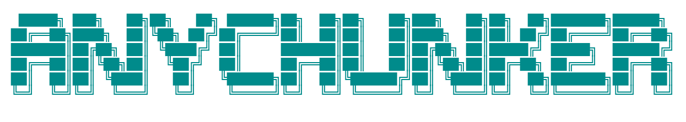

<p align="center">
  
</p>

<p align="center">
    <a href="https://clawhub.ai/anyforge/skills/anychunker-skills" target="_blank"></a>
    <a href="https://skillhub.cn/skills/anychunker-skills" target="_blank"></a>
    <a href="https://www.modelscope.cn/skills/anyforge/anychunker-skills/" target="_blank"></a>
    <a href="https://pypi.org/project/anychunker/"></a>
    <a href="https://pypi.org/project/anychunker/"></a>
    <a href="https://deepwiki.com/anyforge/anychunker/"></a>
</p>

# AnyChunker

Split any text for LLM or RAG or Agent.

Specially supports block-based splitting, keeping Markdown elements intact.

- text, semantics, token, markdown, code language, custom, etc.

## install

```bash
pip install anychunker

or

pip install -e .
```

## 0. special markdown block split

```python
from anychunker import AnyMarkdownBlockChunker

markdown_document = '''
dasdasdasda
# title1

    ## Bar
# title1-1

    ## Bar-1
Hi this is Jim

### Boo 

Hi this is Lance 

# title2

## Baz
\```code
# 测试
def test():
    # 打印
    print('ok')
\```

<table>
    <th>1111
    </th>
</table>
'''

chunker = AnyMarkdownBlockChunker(
    chunk_size = 100,
    chunk_overlap = 5,
)

res = chunker.invoke(markdown_document)
res.chunks

# Output:

[Chunker(metadata={'block_id': 0, 'chunk_id': 0, 'title': {}, 'headings': {}, 'chunk_parent_id': [], 'chunk_child_id': [], 'block_parent_id': [], 'block_child_id': [1, 2, 3, 4], 'chunk_size': 11, 'chunk_overlap': 100, 'start_pos': 1, 'end_pos': 12}, chunk_id=0, chunk_size=11, start_pos=1, end_pos=12, content='dasdasdasda'),
 Chunker(metadata={'block_id': 1, 'chunk_id': 0, 'title': {'name': 'title1', 'value': ['title1']}, 'headings': {}, 'chunk_parent_id': [], 'chunk_child_id': [], 'block_parent_id': [0], 'block_child_id': [2, 3, 4], 'chunk_size': 6, 'chunk_overlap': 100, 'start_pos': 27, 'end_pos': 33}, chunk_id=0, chunk_size=6, start_pos=27, end_pos=33, content='## Bar'),
 Chunker(metadata={'block_id': 2, 'chunk_id': 0, 'title': {'name': 'title1-1', 'value': ['title1-1']}, 'headings': {}, 'chunk_parent_id': [], 'chunk_child_id': [1], 'block_parent_id': [1, 0], 'block_child_id': [3, 4], 'chunk_size': 13, 'chunk_overlap': 100, 'start_pos': 46, 'end_pos': 59}, chunk_id=0, chunk_size=13, start_pos=46, end_pos=59, content='    ## Bar-1\n'),
 Chunker(metadata={'block_id': 2, 'chunk_id': 1, 'title': {'name': 'title1-1', 'value': ['title1-1']}, 'headings': {}, 'chunk_parent_id': [0], 'chunk_child_id': [], 'block_parent_id': [1, 0], 'block_child_id': [3, 4], 'chunk_size': 14, 'chunk_overlap': 100, 'start_pos': 59, 'end_pos': 73}, chunk_id=1, chunk_size=14, start_pos=59, end_pos=73, content='Hi this is Jim'),
 Chunker(metadata={'block_id': 3, 'chunk_id': 0, 'title': {'name': 'title1-1', 'value': ['title1-1']}, 'headings': {'name': 'Boo', 'value': ['Boo']}, 'chunk_parent_id': [], 'chunk_child_id': [], 'block_parent_id': [2, 1, 0], 'block_child_id': [4], 'chunk_size': 16, 'chunk_overlap': 100, 'start_pos': 85, 'end_pos': 101}, chunk_id=0, chunk_size=16, start_pos=85, end_pos=101, content='Hi this is Lance'),
 Chunker(metadata={'block_id': 4, 'chunk_id': 0, 'title': {'name': 'title2', 'value': ['title2']}, 'headings': {'name': 'Baz', 'value': ['Baz']}, 'chunk_parent_id': [], 'chunk_child_id': [1], 'block_parent_id': [3, 2, 1, 0], 'block_child_id': [], 'chunk_size': 53, 'chunk_overlap': 100, 'start_pos': 121, 'end_pos': 174}, chunk_id=0, chunk_size=53, start_pos=121, end_pos=174, content="```code\n# 测试\ndef test():\n    # 打印\n    print('ok')\n```"),
 Chunker(metadata={'block_id': 4, 'chunk_id': 1, 'title': {'name': 'title2', 'value': ['title2']}, 'headings': {'name': 'Baz', 'value': ['Baz']}, 'chunk_parent_id': [0], 'chunk_child_id': [], 'block_parent_id': [3, 2, 1, 0], 'block_child_id': [], 'chunk_size': 39, 'chunk_overlap': 100, 'start_pos': 176, 'end_pos': 215}, chunk_id=1, chunk_size=39, start_pos=176, end_pos=215, content='<table>\n    <th>1111\n    </th>\n</table>')]

```

## 1. recursive split text

```python
from anychunker import AnyTextChunker

text = """
# 1111
## 1111.22
dsdsdsds

## 1.4 dsdsdd
dajajfsdfds
###### dsdsdsd
"""
```

### by regex split

```python
## by regex split

model1 = AnyTextChunker(chunk_size = 50, chunk_overlap = 0)
model1.invoke(text)


    Document(metadata=DocumentMetadata(created=datetime.datetime(2025, 7, 22, 15, 1, 59, 827280), name='default', topic='default', tag='default', length=70), chunks=[Chunker(metadata={}, chunk_id=0, chunk_size=26, start_pos=1, end_pos=27, content='# 1111\n## 1111.22\ndsdsdsds'), Chunker(metadata={}, chunk_id=1, chunk_size=40, start_pos=29, end_pos=69, content='## 1.4 dsdsdd\ndajajfsdfds\n###### dsdsdsd')])
```

### auto batch doc

```python
for x in model1.invoke(text).batchIterator(batch_size = 1):
    print(x,'\n\n')


    ChunkBatcher(batch_index=0, batch_size=1, chunks=[Chunker(metadata={}, chunk_id=0, chunk_size=26, start_pos=1, end_pos=27, content='# 1111\n## 1111.22\ndsdsdsds')], metadata=DocumentMetadata(created=datetime.datetime(2025, 7, 22, 15, 2, 2, 861414), name='default', topic='default', tag='default', length=70), actual_size=1, total_content_length=26, start_chunk_id=0, end_chunk_id=0) 
  
  
    ChunkBatcher(batch_index=1, batch_size=1, chunks=[Chunker(metadata={}, chunk_id=1, chunk_size=40, start_pos=29, end_pos=69, content='## 1.4 dsdsdd\ndajajfsdfds\n###### dsdsdsd')], metadata=DocumentMetadata(created=datetime.datetime(2025, 7, 22, 15, 2, 2, 861414), name='default', topic='default', tag='default', length=70), actual_size=1, total_content_length=40, start_chunk_id=1, end_chunk_id=1) 
```

### by transformer tokenizer

```python
## by transformer tokenizer
model2 = AnyTextChunker.from_tokenizer("Qwen/Qwen3-8B",chunk_size = 50, chunk_overlap = 0)
model2.invoke(text)


    Document(metadata=DocumentMetadata(created=datetime.datetime(2025, 7, 22, 14, 57, 45, 431157), name='default', topic='default', tag='default', length=45), chunks=[Chunker(metadata={}, chunk_id=0, chunk_size=43, start_pos=1, end_pos=44, content='# 1111\n## 1111.22\ndsdsdsds\n\n## 1.4 dsdsdd\ndajajfsdfds\n###### dsdsdsd')])
```

### by any tokenizer

```python
import jieba

def _tokenizer_length(text: str) -> int:
    return len(jieba.lcut(text))

model1 = AnyTextChunker(chunk_size = 50, chunk_overlap = 0, length_function = _tokenizer_length,)
model1.invoke(text)

```

### by language

```python
## by language
from anychunker import Language

model3 = AnyTextChunker.from_language(Language.MARKDOWN,chunk_size = 50, chunk_overlap = 0)
model3.invoke(text)


    Document(metadata=DocumentMetadata(created=datetime.datetime(2025, 7, 22, 14, 59, 4, 222919), name='default', topic='default', tag='default', length=70), chunks=[Chunker(metadata={}, chunk_id=0, chunk_size=26, start_pos=1, end_pos=27, content='# 1111\n## 1111.22\ndsdsdsds'), Chunker(metadata={}, chunk_id=1, chunk_size=40, start_pos=29, end_pos=69, content='## 1.4 dsdsdd\ndajajfsdfds\n###### dsdsdsd')])


## other language
from anychunker import AnyCodeChunker
```

## 2. super markdown header split

```python
from anychunker import AnyMarkdownChunker

text = """
# 1111
## 1111.22
dsdsdsds

## 1.4 dsdsdd
dajajfsdfds
###### dsdsdsd
"""
model4 = AnyMarkdownChunker([('#','header1'),('##','Header2')])
model4.invoke(text)


   Document(metadata=DocumentMetadata(created=datetime.datetime(2025, 7, 22, 15, 2, 55, 76103), name='default', topic='default', tag='default', length=70), chunks=[Chunker(metadata={'header1': '1111', 'Header2': '1111.22'}, chunk_id=0, chunk_size=8, start_pos=19, end_pos=27, content='dsdsdsds'), Chunker(metadata={'header1': '1111', 'Header2': '1.4 dsdsdd'}, chunk_id=1, chunk_size=26, start_pos=43, end_pos=69, content='dajajfsdfds\n###### dsdsdsd')])
```

## 3. Semantics text split

```python
from anychunker import AnySemanticsChunker
from sentence_transformers import SentenceTransformer

# Load the model
model_dir = "Qwen/Qwen3-Embedding-0.6B"
model = SentenceTransformer(model_dir)

def emb_model(sentences):
    return model.encode(sentences).tolist()


model5 = AnySemanticsChunker(embedding_model = emb_model)

text = """
# 1111
## 1111.22
dsdsdsds.

## 1.4 dsdsdd
dajajfsdfds.
###### dsdsdsd
"""

model5.invoke(text)

Document(metadata=DocumentMetadata(created=datetime.datetime(2025, 7, 22, 16, 9, 12, 397166), name='default', topic='default', tag='default', length=72), chunks=[Chunker(metadata={}, chunk_id=0, chunk_size=17, start_pos=1, end_pos=18, content='# 1111\n## 1111.22'), Chunker(metadata={}, chunk_id=1, chunk_size=51, start_pos=-1, end_pos=50, content='dsdsdsds.\n## 1.4 dsdsdd\ndajajfsdfds.\n###### dsdsdsd')])
```

```python
# see all functions

docs = model5.invoke(text)

dir(docs)
```
